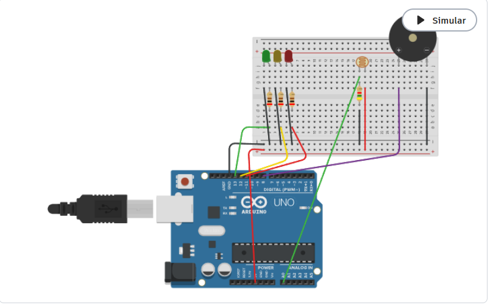

# Checkpoint-01---Edge-Computing

🍷 Sistema de Monitoramento de Luminosidade para Vinheria

📌 Descrição do Projeto

Este projeto foi desenvolvido como parte de um desafio proposto pela Vinheria Agnello. O objetivo é criar um sistema de monitoramento de luminosidade utilizando Arduino, garantindo que as condições ambientais estejam adequadas para o armazenamento de vinhos.

A luminosidade é um fator crítico que pode impactar diretamente a qualidade do vinho. Portanto, o sistema coleta dados do ambiente e sinaliza possíveis problemas por meio de LEDs e um buzzer.

🎯 Objetivos
- Monitorar a luminosidade do ambiente utilizando um sensor LDR.
- Converter sinais analógicos em digitais através do ADC do Arduino.
- Indicar o estado do ambiente com LEDs:
🟢 Verde: Ambiente OK;
🟡 Amarelo: Nível de alerta;
🔴 Vermelho: Problema detectado.
Acionar um buzzer quando houver problema na luminosidade.

🛠️ Componentes Utilizados
- Arduino (Uno, Nano ou similar);
- LDR (serve para medir a luz do ambiente);
- Resistores (para divisor de tensão e LEDs).
- LEDs(indicar a luminosidade ideal para a conserva do vinho):
  Verde ;
  Amarelo ;
  Vermelho.
- Buzzer;
- Protoboard;
- Jumpers.

⚙️ Funcionamento do Sistema

1. O LDR capta a intensidade luminosa do ambiente.
2. O Arduino lê o valor analógico através de sua porta ADC.
3. Com base em limites pré-definidos:
- Valor dentro do ideal → LED verde aceso;
- Valor em alerta → LED amarelo aceso;
- Valor crítico → LED vermelho aceso + buzzer ativado.
4. Caso o problema persista, o buzzer é acionado novamente por 3 segundos.

🔌 Esquema Básico

- LDR conectado em um divisor de tensão (entrada analógica A0);
- LEDs conectados a pinos digitais (com resistores);
- Buzzer conectado a um pino digital.

💡 Lógica de Controle (Resumo)

if (luminosidade < limite_ok) {
  // LED verde
}
else if (luminosidade < limite_alerta) {
  // LED amarelo
}
else {
  // LED vermelho + buzzer
}

🔔 Comportamento do Buzzer

- Ativado quando a luminosidade estiver em nível crítico;
- Permanece ligado por 3 segundos;
- Reativa caso o problema continue.

📊 Possíveis Melhorias

- Monitoramento de temperatura e umidade;
- Integração com display LCD/OLED;
- Envio de dados para a nuvem (IoT);
- Notificações via aplicativo.

🚀 Como Executar

1. Monte o circuito conforme descrito;
2. Conecte o Arduino ao computador;
3. Faça upload do código via Arduino IDE;
4. Observe os LEDs e o buzzer conforme a variação de luz.

📚 Conceitos Envolvidos

- LDR (Sensor de luz);
- Divisor de tensão;
- Conversão Analógico-Digital (ADC);
- Sistemas embarcados;
- Monitoramento ambiental.

🔧 Passo a Passo para Montagem do Sistema

1. **Organize os componentes**
   Separe o Arduino, LDR, resistores, LEDs (verde, amarelo e vermelho), buzzer, protoboard e jumpers. Isso facilita a montagem e evita erros.

2. **Monte o divisor de tensão com o LDR**

   * Conecte uma perna do LDR ao **5V** do Arduino.
   * Conecte a outra perna do LDR a uma linha da protoboard.
   * Dessa mesma linha, conecte um resistor (ex: 10kΩ) ao **GND**.
   * Conecte um jumper dessa junção ao pino **A0** do Arduino.
     👉 Esse conjunto permitirá medir a luminosidade.

3. **Conecte o LED verde (ambiente OK)**

   * Conecte o terminal positivo (perna maior) a um pino digital (ex: D2).
   * Conecte o terminal negativo a um resistor (220Ω) e depois ao GND.

4. **Conecte o LED amarelo (alerta)**

   * Terminal positivo → pino digital (ex: D3).
   * Terminal negativo → resistor (220Ω) → GND.

5. **Conecte o LED vermelho (problema)**

   * Terminal positivo → pino digital (ex: D4).
   * Terminal negativo → resistor (220Ω) → GND.

6. **Conecte o buzzer**

   * Terminal positivo → pino digital (ex: D5).
   * Terminal negativo → GND.

7. **Revise todas as conexões**
   Confira se:

   * Não há curto-circuitos;
   * Todos os GNDs estão conectados corretamente;
   * Os resistores estão posicionados corretamente com os LEDs.

8. **Conecte o Arduino ao computador**
   Utilize o cabo USB para alimentação e envio do código.

9. **Faça o upload do código**

   * Abra a Arduino IDE;
   * Cole o código do projeto;
   * Selecione a placa e a porta correta;
   * Clique em “Upload”.

10. **Teste o sistema**

* Cubra o LDR para simular baixa luminosidade;
* Exponha à luz para simular alta luminosidade;
* Observe a troca entre os LEDs e o acionamento do buzzer.

📄 Licença

Este projeto é de uso educacional.

Equipe:

-Luiz Alberto De Carvalho Holanda Junior;
-Felipe Ribeiro Da Silva;
-Milena Kubo de Biaggi;
-Yasmim Eun Hae Kim;
